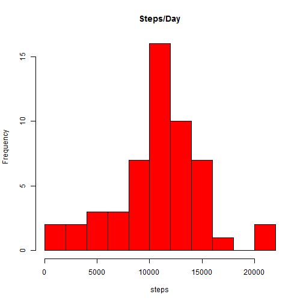
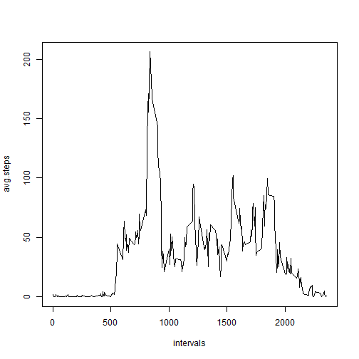
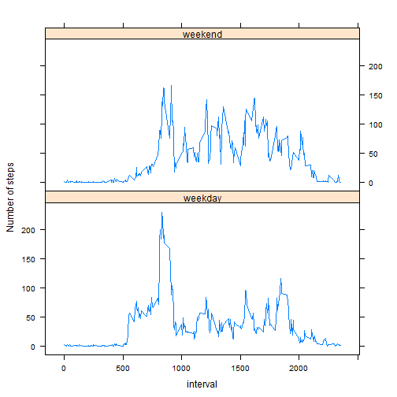

###Loading and processing the data
1. Load the data

```r
activity <- read.csv("activity.csv")
```
2. Process/transform the date vatiable in the data to actual date class in R

```r
activity$date <- as.Date(activity$date)
```


###What is mean total number of steps taken per day?
For this part of the assignment, you can ignore the missing values in the dataset.

1. Make a histogram of the total number of steps taken each day

```r
day.steps <- tapply(activity$steps, activity$date, sum)
hist(day.steps, breaks = 10, col = "red", xlab = "steps", main = "Steps/Day")
```

 

2. Calculate and report the mean and median total number of steps taken per day

```r
mean(day.steps, na.rm = T)
median(day.steps, na.rm = T)
```

mean = 1.0766 &times; 10<sup>4</sup> and median = 10765 


###What is the average daily activity pattern?

1. Make a time series plot (i.e. `type = "l"`) of the 5-minute interval (x-axis) and the average number of steps taken, averaged across all days (y-axis)

```r
avg.steps <- tapply(activity$steps, activity$interval, mean, na.rm = T)

#get the numeric vector representing the levels of the 5-min intervals
intervals <- as.numeric(levels(factor(activity$interval)))
plot(intervals, avg.steps, type = "l")
```

 

2. Which 5-minute interval, on average across all the days in the dataset, contains the maximum number of steps?

```r
intervals[avg.steps == max(avg.steps)]
```
Maximum number of steps is in interval 835


###Imputing missing values
Note that there are a number of days/intervals where there are missing values (coded as `NA`). The presence of missing days may introduce bias into some calculations or summaries of the data.

1. Calculate and report the total number of missing values in the dataset (i.e. the total number of rows with `NA's`)

```r
sum(is.na(activity))
```
Number of Na's is equal to 2304

2. Devise a strategy for filling in all of the missing values in the dataset  
Using the mean for that 5-minute interval

```r
# for each step that is NA, replace it with the average number of steps
# in that 5-min interval, this can be easily done by indexing by the name 
# of the interval in the avg.steps vector
# see `str(avg.steps)` for details
for (i in 1:nrow(activity)) {
	if (is.na(activity[i, "steps"])) {
		index <- activity[i, "interval"]
		activity[i, "steps"] <- avg.steps[toString(index)]
	}
}
```

3. Make a histogram of the total number of steps taken each day and Calculate and report the mean and median total number of steps taken per day

```r
day.steps <- tapply(activity$steps, activity$date, sum)
hist(day.steps, breaks = 10, col = "green", xlab = "steps", 
     main = "Steps/Day NA's Filled")
```

 


Calculating mean and median

```r
# notice that there is no `na.rm = TRUE` here
mean(day.steps)
median(day.steps)
```
mean = 1.0766 &times; 10<sup>4</sup> and median = 1.0766 &times; 10<sup>4</sup>    

*Do these values differ from the estimates from the first part of the assignment?*  
There is a slight difference


###Are there differences in activity patterns between weekdays and weekends?
For this part the `weekdays()` function may be of some help here. Use the dataset with the filled-in missing values for this part.

1. Create a new factor variable in the dataset with two levels – “weekday” and “weekend” indicating whether a given date is a weekday or weekend day.

```r
#days is a vector containing day names "Saturday", "Monday", ...
days <- weekdays(activity$date)

#make a new factor variable day which is either `weekend` for weekend days
#or `weekday` for other days
activity$day <- ifelse(days == "Saturday" | days == "Sunday", 
			    "weekend", "weekday")
activity$day <- as.factor(activity$day)
```

2. Make a panel plot containing a time series plot (i.e. `type = "l"`) of the 5-minute interval (x-axis) and the average number of steps taken, averaged across all weekday days or weekend days (y-axis)

```r
#split the whole data frame into two smaller data frames for each of the weekdays
#and weekends
activity.byday <- split(activity, activity$day)

#same as avg.steps but now considering both day types
mean.steps.byday <- lapply(activity.byday, function(df){
	tapply(df$steps, df$interval, mean)
})

#put the results in a cleaner data set for plotting
activity.clean <- data.frame(interval = rep(intervals, 2), 
			mean.steps.byday = as.vector(unlist(mean.steps.byday)), 
			day = factor(rep(c("weekday", "weekend"), each = 288)))

library(lattice)
xyplot(mean.steps.byday ~ interval | day, data = activity.clean, layout = c(1, 2),
       type = "l", ylab = "Number of steps")
```

 
